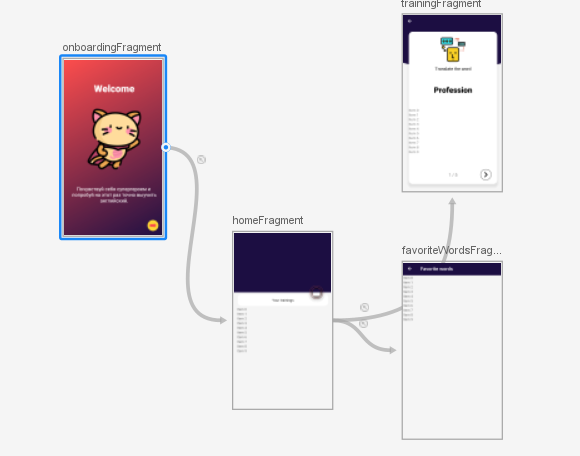

# Labs 3-4

Reports for labs 3-4.

### Link to FIGMA layout:

### Files:
UI (lab 3-4):
/res/layout/*
/res/drawable/*
/res/navigation/*
./ui/*

### Screenshots:

Screens in editor:

Nav graph:

### Working ui:

Listening page:

Word translation page:

